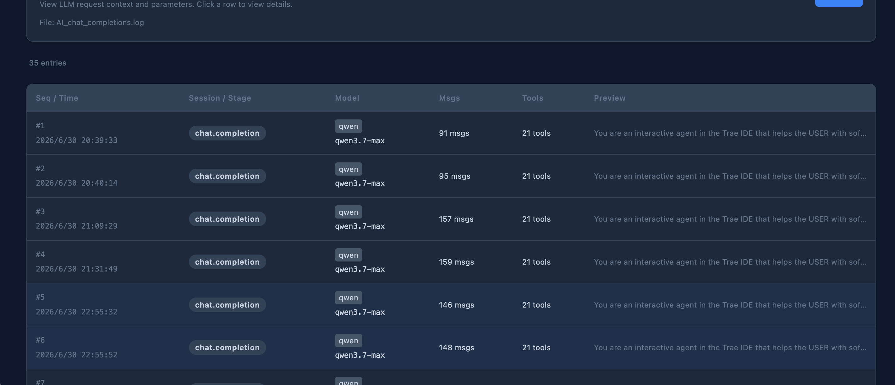

# LLM Trace Viewer

一个查看 **LLM 请求追踪日志** 的浏览器插件，在美观的 Web UI 中浏览系统提示词、消息历史、工具定义等信息。

A browser extension to view **LLM request trace logs** in a beautiful web UI.

Supports JSONL trace files and nginx access logs with embedded `request_body` — drag & drop a file to browse system prompts, message history, tool definitions, and more.




## 功能 / Features

- 拖拽或文件选择器加载追踪日志（支持 JSONL 和 nginx access log 格式）
- 自动保存上次打开的文件（File System Access API + IndexedDB），下次一键刷新
- 分页列表视图，按时间倒序浏览
- 详情弹窗，查看完整消息、工具、系统提示词、错误信息
- 图片支持，base64 图片缩略图 + 灯箱预览
- 深色/浅色主题，自动检测 + 手动切换
- 导出单条记录为 JSON 下载

## 安装 / Installation

### 以 Chrome 插件方式加载 / Load as Chrome Extension

```bash
# 克隆项目 / Clone
git clone https://github.com/wugao123456/llm-trace-viewer.git
cd llm-trace-viewer
npm install
npm run build
```

然后在 Chrome 中加载 / Then in Chrome:

1. 打开 `chrome://extensions/`
2. 开启右上角的 **「开发者模式」**
3. 点击 **「加载已解压的扩展程序」**
4. 选择 `dist/extension/` 目录

### 使用方法 / Usage

点击工具栏中的插件图标，自动打开新标签页：

- **拖拽** `.jsonl` 或 `.log` 文件到页面
- 或点击 **Choose File** 按钮选择文件

首次加载后文件会被记住，下次打开页面会显示 **Quick Reload** 按钮，一键重新加载最新日志。

## 支持的格式 / Supported Formats

### JSONL 格式

每行一个 JSON 对象，只需 `ts` 和 `seq` 字段：

```json
{"ts":"2025-04-10T10:30:00.000Z","seq":1,"stage":"stream:context","provider":"openai","modelId":"gpt-4o","messages":[{"role":"user","content":"Hello"}]}
```

### Nginx Access Log 格式

自动解析 nginx 日志中的 `request_body` 字段：

```
127.0.0.1 - [30/Jun/2026:20:39:33 +0800] "POST /v1/chat/completions HTTP/1.1" 200 25384 "" "hertz" "::1" "request_body:{...}" "upstream_response_time:11.732" "upstream_addr:..."
```

### 字段说明 / Field Reference

| 字段 | 类型 | 说明 |
| ----- | ---- | ----------- |
| **`ts`** | `string` | ISO 8601 时间戳 |
| **`seq`** | `number` | 唯一序列号 |
| `stage` | `string` | 阶段标签（`session:*` 蓝色, `prompt:*` 黄色, `stream:*` 绿色） |
| `sessionKey` | `string` | 会话标识符 |
| `provider` | `string` | LLM 提供商名称 |
| `modelId` | `string` | 模型标识符 |
| `system` | `string \| object` | 系统提示词 |
| `prompt` | `string` | 用户提示词 |
| `messages` | `array` | 消息历史（role + content） |
| `tools` | `array` | 工具定义（name + description） |
| `messageCount` | `number` | 消息数量 |
| `toolCount` | `number` | 工具数量 |
| `error` | `string` | 错误信息（红色高亮） |

### 消息内容类型 / Message Content Types

| `type` | 渲染方式 |
| ------ | ----------- |
| `"text"` | 预格式化文本块 |
| `"image"` | 可点击缩略图 + 灯箱 |
| `"thinking"` | 黄色边框思维块 |
| `"toolCall"` | 蓝色边框工具调用（含 JSON 参数） |

## 项目架构 / Architecture

```
llm-trace-viewer/
├── manifest.json              # Chrome 扩展清单 (MV3)
├── src/
│   ├── extension/
│   │   └── background.ts      # Service Worker（点击图标打开新标签页）
│   └── ui/
│       ├── index.html         # 入口 HTML
│       ├── main.ts            # 应用启动
│       ├── app.ts             # 主 Lit 组件（状态管理、路由、文件加载）
│       ├── trace-view.ts      # 渲染逻辑（表格、弹窗、分页）
│       ├── file-parser.ts     # 本地文件解析器（JSONL + nginx 日志）
│       ├── file-store.ts      # IndexedDB 持久化（快速重新加载）
│       ├── styles.ts          # CSS 样式（主题变量）
│       ├── dropzone-styles.ts # 拖拽区样式
│       └── types.ts           # TypeScript 类型定义
├── scripts/
│   └── generate-icons.ts      # 图标生成
├── vite.config.ts             # Vite 构建配置（多入口）
├── package.json
└── tsconfig.json
```

- **UI** (`src/ui/`): 基于 [Lit](https://lit.dev/) Web Components 的单页应用
- **Parser** (`file-parser.ts`): 自动检测 JSONL vs nginx 日志格式，纯浏览器端解析
- **Persistence** (`file-store.ts`): File System Access API + IndexedDB 实现文件记忆与快速重载

## 开发 / Development

```bash
npm install
npm run dev        # Vite 开发服务器 → http://localhost:5173
npm run build      # 生产构建 → dist/extension/
npm run typecheck  # TypeScript 类型检查
```

## License

MIT
